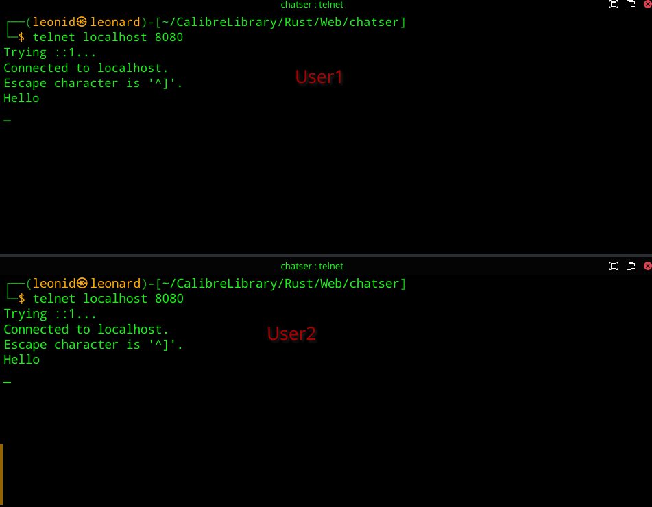
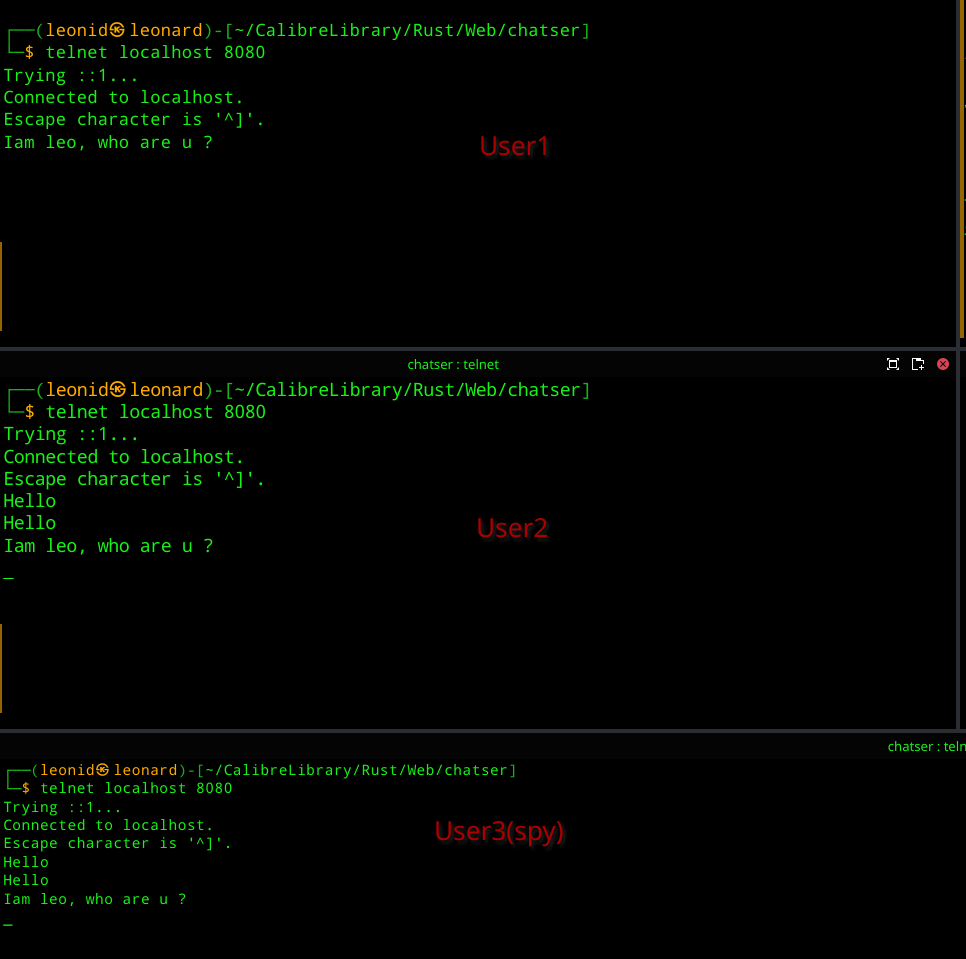
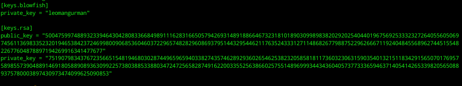
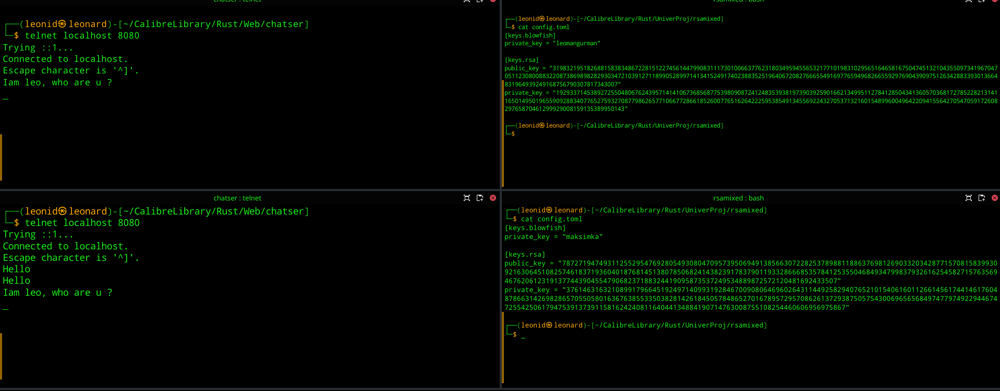
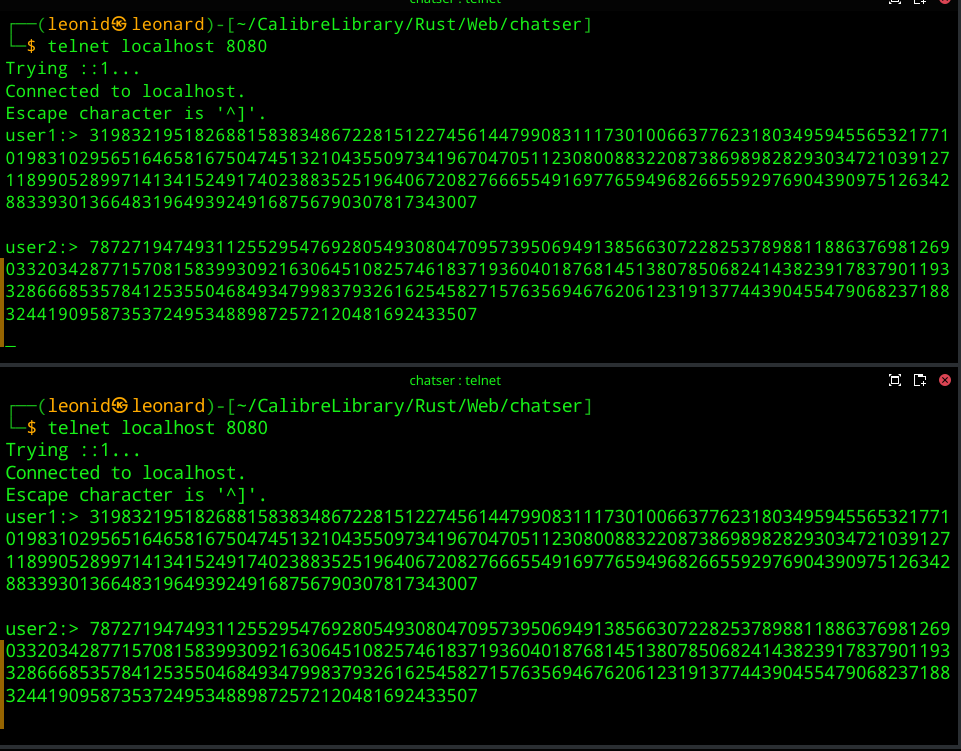

# Комбинированная криптосистема на основе алгоритмов RSA и Blowfish

## Пример применения

Допустим имеется чат-сервер данные на котором представленны в открытом виде,  на нем происходит общение двух пользователей **User1** и **User2**.

Но внезапно появляется левый пользователь, который хочет подслушать, о чем разговаривают User1 и User2

Что в таком случае можно сделать, чтобы предотвартить раскрытие информации со стороны пользователя **User3** и при этом быть уверенным, что сообщения приходят от определенного пользователя? В таком случее предлагается использовать комбинированную криптосистему с открытым ключем.

## Генерация ключей
Сгенерируем ключи для User1. Для шифрования сообщения будем использовать алгоритм Blowfish.

Сгенерируем ключи для User2. Для шифрования сообщения будем использовать алгоритм Blowfish.

Публичные и приватные ключи, а также ключи для Blowfish сгенерированны. Давайте ими обменяемся

Зашифруем наше сообщенеие ключем Blowfish, а ключ Blowfish зашифруем публичным ключом User2
